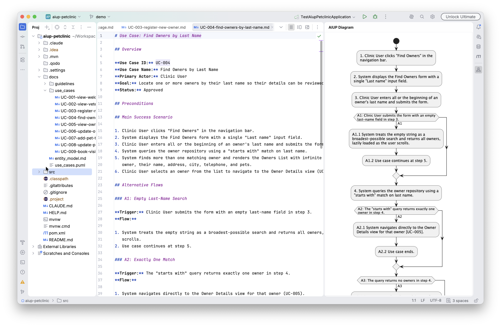

# AI Unified Process Navigator

IntelliJ plugin to navigate between `@UseCase`-annotated Java test methods and their Markdown specs in
[AI Unified Process (AIUP)](https://unifiedprocess.ai) projects — with a live activity diagram of the
Use Case spec you are editing.



## Setup

The plugin requires the host project to define a Java annotation type named `UseCase`. It is looked up by short name, so
any package works. The canonical shape is:

```java
@Target(ElementType.METHOD)
@Retention(RetentionPolicy.RUNTIME)
@Documented
public @interface UseCase {
    String id();

    String scenario() default "Main Success Scenario";

    String[] businessRules() default {};
}
```

When the plugin opens a project that contains Markdown Use Case specs but no `UseCase` annotation type, it shows a
one-time balloon notification with a **Create `UseCase.java`** action: pick a source root and the file is scaffolded for
you.

## Features

### Activity diagram tool window

The **AIUP Diagram** tool window (right-hand side) shows a live PlantUML activity diagram of the Use Case
spec in the selected editor: the main flow forms the numbered spine, and every Alternative
Flow branches at the step its trigger references (e.g. `(Schritt 3)` / `(step 3)`) and rejoins the flow
after its own steps. The diagram updates as you type (debounced) and is rendered entirely in-process with
the MIT-licensed PlantUML build and the Smetana layout engine — no Graphviz installation, no external
rendering service, the spec content never leaves the IDE.

Both English and German spec styles are recognised: `## Main Success Scenario` / `## Hauptszenario` /
`## Hauptablauf` for the main flow, and `## Alternative Flows` / `## Alternativszenarien` /
`## Alternativabläufe` for the alternative flows. Flow headings may carry a label (`### A1: …`, branching
at the step the `**Trigger:**` references) or a step code in the German style (`### 3a. Keine Treffer
gefunden`, branching directly at step 3). Sub-bullets under a numbered step are treated as detail and
kept out of the step's diagram node.

### Gutter icons

In Java:

* `@UseCase(id = "UC-XXX")` jumps to the matching spec file, landing on the scenario heading and any business
  rule headings referenced via `businessRules = {...}`.

In Markdown specs:

* `**Use Case ID:** UC-XXX` jumps to all test methods annotated with that ID.
* `# Title` (H1) jumps to the test class(es) containing those methods.
* `## Main Success Scenario` / `## Hauptszenario` / `## Hauptablauf` jumps to test methods with no `scenario`
  attribute (or one of those labels as the `scenario` value).
* `### A1: ...` or `### 3a. ...` (alternative-flow headings coded as `<Letter><Digits>` or `<Step><letter>`) jumps to
  test methods whose `scenario` starts with that code.
* `### BR-XXX` business rule headings — or `- **GR-XXX:** …` bullet items in the German style — jump to test methods
  that reference that rule via `businessRules = {"BR-XXX"}`, scoped to the Use Case declared by the spec file
  (rule ids are unique only within a UC).

### Find Usages (Alt+F7)

Find Usages is wired in both directions, mirroring the gutter icons:

* On a `@UseCase` annotation or its `id` literal — finds spec leaves (scenario heading + BR headings).
* On a string inside `businessRules = {...}` — finds the matching `### BR-XXX` heading in the spec.
* On `**Use Case ID:** UC-XXX`, the H1 title, `## Main Success Scenario`, `### A1: ...`, and `### BR-XXX` lines —
  finds the corresponding test methods or test classes.

### Inspection

* **Use Case ID has no matching spec** — flags `@UseCase(id = "UC-XXX")` whose ID has no spec file in the project.

## Conventions used

The plugin works with the Markdown conventions from the AIUP PetClinic example:

```markdown
# View Veterinarians

**Use Case ID:** UC-002

## Main Success Scenario

### A1: No Veterinarians Found

### BR-001: Lazy Loading
```

and with the German AIUP spec style, which declares the ID in the title and codes alternative flows by step:

```markdown
# UC-001: Kunde suchen

## Hauptablauf

## Alternativabläufe

### 3a. Keine Treffer gefunden

## Geschäftsregeln

- **GR-001:** Inaktive Kunden werden standardmässig nicht angezeigt.
```

Use Case IDs may be plain `UC-XXX` or the `SUC-XXX` / `BUC-XXX` variants (System / Business Use Case). Spec files are
matched three ways:

* **By file name** — the ID at the start of the name (`UC-002-view-veterinarians.md`,
  `UC-032_Kundeninformationen_bearbeiten.md`, `SUC-001-*.md`, `BUC-001-*.md`) or after an arbitrary project prefix
  (`petclinic-UC-002-*.md`, `*-SUC-*.md`, `*-BUC-*.md`).
* **By body line** — a `**Use Case ID:** UC-XXX` declaration anywhere in the file.
* **By title** — an H1 starting with the ID, e.g. `# UC-001: Kunde suchen` (used when no body line exists).

See [Setup](#setup) above for the matching Java annotation shape.

## Build

```bash
./gradlew build
```

The plugin zip will be in `build/distributions/`.

## Try it locally

```bash
./gradlew runIde
```

This launches a sandbox IntelliJ with the plugin installed. Open your `aiup-petclinic` project in it.

## Install in your IDE

* `./gradlew buildPlugin`
* In IntelliJ: `Settings` -> `Plugins` -> gear icon -> `Install Plugin from Disk...`
* Pick the zip file from `build/distributions/`.

## Compatibility

Targets IntelliJ IDEA 2026.1 and later (build 261+, no upper bound). Adjust `sinceBuild` / `untilBuild` and the
platform dependency in `build.gradle.kts` if you need a different range. Requires the bundled Markdown plugin.

## Notes

* The spec lookup scans Markdown files in the project. For very large projects you may want to add an index later. For
  typical AIUP repos the scan is fast enough because the spec folder is small.
* If you rename the annotation, the lookup still works as long as it is called `UseCase` and is an annotation type.
